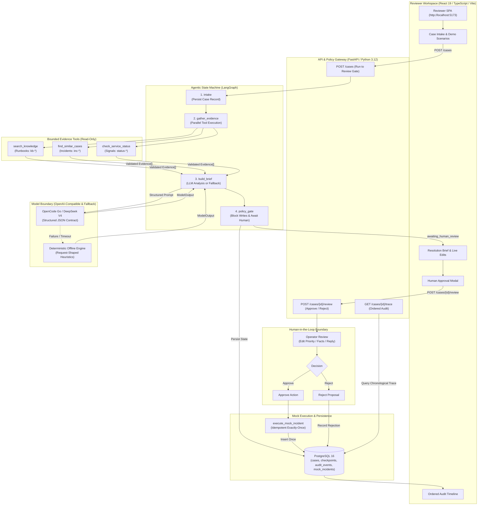

# AI Support Operator Copilot

> **An agentic AI workflow with bounded autonomy, multi-source evidence grounding, and deterministic human policy gates.**

<div align="center">

[](https://langchain-ai.github.io/langgraph/)
[](https://www.python.org/)
[](https://fastapi.tiangolo.com/)
[](https://docs.pydantic.dev/)
[](https://www.postgresql.org/)
[](https://react.dev/)
[](https://www.typescriptlang.org/)
[](https://www.docker.com/)
[](LICENSE)

</div>

---

## 📌 System Context & Architecture

**Evolution & Background.** Building on operational experience with support workflows and knowledge retrieval (such as [Support Operator Panel](https://github.com/laser54/support_operator_panel) and [assist-craft-qna](https://github.com/laser54/assist-craft-qna)), **AI Support Operator Copilot** refactors the operational domain into a modern **agentic, multi-tool orchestration architecture**.

**Problem.** In mission-critical customer support and SRE operations, incoming requests arrive unstructured, incomplete, and urgent. Standard LLM chatbots frequently hallucinate, lack access to live telemetry, and cannot be trusted with autonomous execution in external issue trackers or production systems.

**Solution.** An explicit state machine (LangGraph) ingests unstructured reports, queries three bounded read-only tools (Runbooks, Historical Incidents, Live Service Status), validates structured analytical inferences via Pydantic v2, drafts cautious customer responses and proposed actions, and **strictly suspends execution at a deterministic code-level Policy Gate**. A human operator reviews, corrects, and authorizes any consequential action.

**Architecture & Scope.** Implements stateful LangGraph orchestration, Pydantic v2 structured model boundaries, dual-engine deterministic fallback, PostgreSQL persistence/checkpoints, an immutable audit trail, and a React 19 reviewer UI.

**Verification & Boundary.** Designed with 100% offline repeatability, mock write isolation, idempotent execution, and full auditability without external API dependencies.

---

## 🏗️ Architecture



---

## 🌟 Architectural Highlights

<table>
<tr>
<td width="50%">

### 🛡️ Bounded Autonomy & Policy Gate
* **Zero Autonomous Writes**: The LLM has strictly zero write privileges in external systems.
* **Drafts by Code**: High-risk actions (`create_incident`) are generated purely as proposals and blocked by backend code.
* **Explicit Authorization**: Side effects execute only upon an explicit `POST /cases/{id}/review` signed off by an operator.

</td>
<td width="50%">

### 🔍 Multi-Source Evidence Grounding
* **Parallel Tool Calling**: Gathers evidence across Runbooks (`kb-*`), Historical Incidents (`inc-*`), and Live Monitoring (`status-*`).
* **Traceable Lineage**: Every claim in the resolution brief references an immutable `source_id`.
* **Strict Fact Isolation**: Clearly separates customer statements, tool evidence, model inferences, and missing data.

</td>
</tr>
<tr>
<td width="50%">

### ⚙️ LangGraph State & Dual-Engine Resilience
* **Durable StateGraph**: Checkpoints saved to PostgreSQL for pause, inspection, and review resumption.
* **Seamless Fallback**: If LLM API keys are absent, the provider times out, or schema validation fails, a request-shaped deterministic offline engine takes over with **zero downtime**.
* **Pydantic v2 Boundary**: `extra="forbid"` JSON schema validation rejects prompt injection or unauthorized payload additions.

</td>
<td width="50%">

### 📜 Immutable Audit Trail & Idempotency
* **Ordered Event Sourcing**: Every state transition, tool call input/output summary, and human edit is persisted with strict `(case_id, sequence)` uniqueness.
* **Exactly-Once Execution**: Primary-key constraints in `mock_incidents` ensure duplicate approvals never create duplicate tickets.
* **Human Edits as Ground Truth**: Operator modifications override AI inferences and form the case's effective final state.

</td>
</tr>
</table>

---

## 🕹️ Interactive Demo Scenarios

The system includes five synthetic catalog scenarios with specialized runbooks, incident histories, and telemetry signals:

| Scenario | Category | Default Priority | Matched Evidence Sources |
|---|---|---|---|
| **Portal Login 500** | `incident/access` | **P1 (High Risk)** | `kb-auth-5xx-after-release`, `inc-104`, `status-portal-auth-5xx` |
| **VPN Certificate Swap** | `incident/network` | **P1 (High Risk)** | `kb-vpn-certificate-rotation`, `inc-218`, `status-vpn-gateway` |
| **Invoice PDF Timeout** | `incident/billing` | **P2 (Medium Risk)** | `kb-invoice-pdf-timeout`, `inc-311`, `status-billing-export` |
| **Outbound Email Delay** | `incident/messaging` | **P2 (Medium Risk)** | `kb-outbound-email-delay`, `inc-402`, `status-smtp-queue` |
| **Okta SSO MFA Loop** | `incident/identity` | **P1 (High Risk)** | `kb-sso-mfa-loop`, `inc-155`, `status-idp-sso` |

---

## 🔌 API Specification

| Method | Endpoint | Description | Role / Gate |
|---|---|---|---|
| `POST` | `/cases` | Create a case and run LangGraph intake through evidence gathering to the review gate | System / Intake |
| `GET` | `/cases/{case_id}` | Retrieve persisted workflow checkpoint, triage, evidence, brief, and provider provenance | Operator / Reviewer |
| `POST` | `/cases/{case_id}/review` | Submit operator corrections, edited customer reply, and approve/reject decision | Human Policy Gate |
| `GET` | `/cases/{case_id}/trace` | Retrieve immutable, chronological audit trail with correlated event sequence | Audit / Compliance |
| `GET` | `/artifacts` | List all fixture entries across Knowledge, Incidents, and Service Status | Knowledge Catalog |
| `POST` | `/artifacts` | Add or update a fixture entry dynamically in the catalogue | Admin / Catalog |
| `DELETE` | `/artifacts/{source_id}` | Remove a fixture entry from the active catalogue | Admin / Catalog |

---

## 🛠️ Technology Stack

<table>
<tr>
<td align="center" width="25%">

**Orchestration & AI**


</td>
<td align="center" width="25%">

**Backend Core**


</td>
<td align="center" width="25%">

**Database & Persistence**


</td>
<td align="center" width="25%">

**Frontend & Quality**


</td>
</tr>
</table>

---

## 🚀 Quick Start

### 1. Run with Docker Compose (Recommended)

Start PostgreSQL 16 and the FastAPI backend:

```powershell
docker compose up --build
```

Access points:
* 🌐 **Reviewer Workspace UI**: [http://localhost:5173](http://localhost:5173)
* 📚 **Interactive Swagger API Docs**: [http://127.0.0.1:8000/docs](http://127.0.0.1:8000/docs)
* 🔍 **API Health Check**: [http://127.0.0.1:8000/](http://127.0.0.1:8000/)

---

### 2. Local Development Setup

The project uses [uv](https://docs.astral.sh/uv/) for Python dependency management and Node.js for the frontend.

#### Backend:
```powershell
# Sync dependencies and run database migrations
uv sync --all-groups
uv run alembic upgrade head

# Start FastAPI development server
uv run uvicorn app.main:app --reload --host 127.0.0.1 --port 8000
```

#### Frontend:
```powershell
cd frontend
npm install
npm run dev
```

---

## 🧪 Quality & Verification Suite

The repository maintains strict test coverage across unit, database integration, accessibility, and E2E layers:

```powershell
# Backend verification (Pytest, Ruff, Mypy)
uv run pytest -q
uv run ruff check .
uv run mypy app

# Frontend verification (Vitest, ESLint, TypeScript)
cd frontend
npm test
npm run lint
npm run typecheck
$env:VITE_API_BASE_URL="http://127.0.0.1:8000"; npm run build
npm run check:bundle

# E2E & Accessibility verification (Playwright & Axe-Core)
npx playwright install chromium
npm run test:e2e
```

---

## 📂 Project Structure

```text
ai-support-operator-copilot/
├── app/
│   ├── api/             # FastAPI REST routes, schemas, rate-limiting
│   ├── domain/          # Pydantic contracts (Case, Evidence, Triage, AuditEvent)
│   ├── graph/           # LangGraph StateGraph, nodes, policy gate
│   ├── llm/             # OpenAI-compatible JSON client & deterministic fallback
│   ├── persistence/     # SQLAlchemy 2.0 models, migrations, repositories
│   └── tools/           # Bounded read-only retrieval tools (KB, Cases, Status)
├── frontend/            # React 19 / TypeScript Reviewer SPA
│   ├── src/
│   │   ├── api/         # Typed API clients & TanStack Query hooks
│   │   ├── app/         # AppShell, ErrorBoundary, navigation layout
│   │   ├── components/  # Primitives (Badge, Button, Card, Dialog, TextField)
│   │   ├── features/    # Case review workspace, intake form, trace timeline
│   │   └── pages/       # HomePage, CasePage, NewCasePage, ArtifactsPage
│   └── e2e/             # Playwright E2E and Axe accessibility test suite
├── fixtures/            # Validated synthetic catalogues (Runbooks, Incidents, Status)
│   ├── knowledge/       # Synthetic Runbooks (kb-*)
│   ├── similar_cases.json # Synthetic Past Incidents (inc-*)
│   └── service_status.json # Synthetic Telemetry Signals (status-*)
├── tests/               # Pytest suite & repository language guards
├── docs/                # Architecture, Product specs, Demo scripts, UI plans
├── compose.yaml         # PostgreSQL 16 & API container definitions
└── pyproject.toml       # Locked Python 3.12 project configuration
```

---

## 🎯 Core Engineering Principles

 1. **Stateful Agentic Workflows**: Building transparent, reproducible multi-step graphs with LangGraph instead of chaotic, uncontrollable multi-agent supervisors.
 2. **Enterprise Safety & Policy Enforcement**: Proving that AI can analyze and draft recommendations without granting write access to production systems.
 3. **Structured Boundary Design**: Strict Pydantic v2 `extra="forbid"` parsing preventing prompt injection and hallucinated action parameters.
 4. **Resilient Dual-Engine Fallback**: Graceful degradation to deterministic heuristics when third-party model providers fail.
 5. **High-Standard Software Engineering**: End-to-end type safety (Python `mypy --strict`, TypeScript `strict: true`), immutable audit trails, and 100% test automation.

---

## 📄 License

This project is licensed under the terms of the [MIT License](LICENSE).
