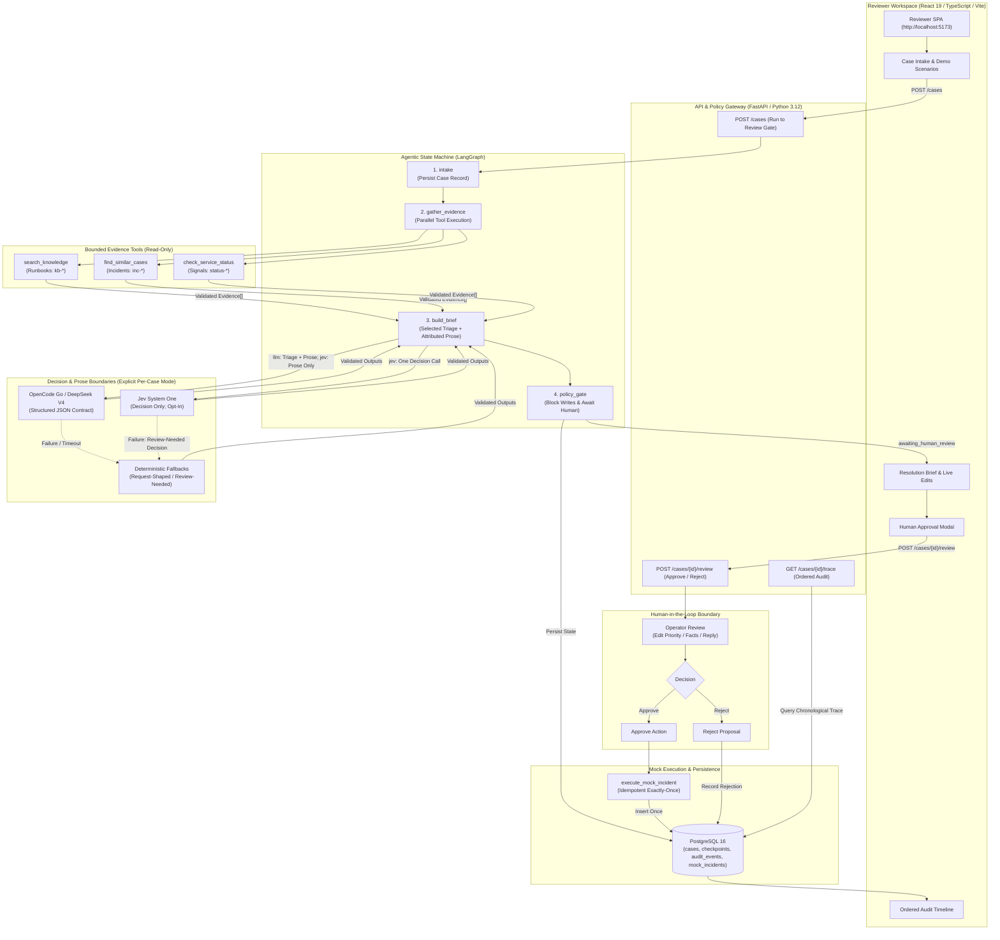

# AI Support Operator Copilot

> **An agentic AI workflow with bounded autonomy, multi-source evidence grounding, and deterministic human policy gates.**

<div align="center">

[](https://langchain-ai.github.io/langgraph/)
[](https://www.python.org/)
[](https://fastapi.tiangolo.com/)
[](https://docs.pydantic.dev/)
[](https://www.postgresql.org/)
[](https://react.dev/)
[](https://www.typescriptlang.org/)
[](https://www.docker.com/)
[](LICENSE)

</div>

---

## 📌 System Context & Architecture

**Evolution & Background.** Building on operational experience with support workflows and knowledge retrieval (such as [Support Operator Panel](https://github.com/laser54/support_operator_panel) and [assist-craft-qna](https://github.com/laser54/assist-craft-qna)), **AI Support Operator Copilot** refactors the operational domain into a modern **agentic, multi-tool orchestration architecture**.

**Problem.** In mission-critical customer support and SRE operations, incoming requests arrive unstructured, incomplete, and urgent. Standard LLM chatbots frequently hallucinate, lack access to live telemetry, and cannot be trusted with autonomous execution in external issue trackers or production systems.

**Solution.** An explicit state machine (LangGraph) ingests unstructured reports, queries three bounded read-only tools (Runbooks, Historical Incidents, Live Service Status), validates structured analytical inferences via Pydantic v2, drafts cautious customer responses and proposed actions, and **strictly suspends execution at a deterministic code-level Policy Gate**. A human operator reviews, corrects, and authorizes any consequential action.

**Architecture & Scope.** Implements stateful LangGraph orchestration, Pydantic v2 structured model boundaries, dual-engine deterministic fallback, PostgreSQL persistence/checkpoints, an immutable audit trail, and a React 19 reviewer UI.

**Verification & Boundary.** Designed with 100% offline repeatability, mock write isolation, idempotent execution, and full auditability without external API dependencies.

---

## 🏗️ Architecture


```mermaid
flowchart TD
    subgraph Client ["Reviewer Workspace (React 19 / TypeScript / Vite)"]
        UI["Reviewer SPA (http://localhost:5173)"]
        Intake["Case Intake & Demo Scenarios"]
        Workspace["Resolution Brief & Live Edits"]
        GateModal["Human Approval Modal"]
        TraceUI["Ordered Audit Timeline"]
    end

    subgraph API ["API & Policy Gateway (FastAPI / Python 3.12)"]
        CaseRoute["POST /cases (Run to Review Gate)"]
        ReviewRoute["POST /cases/{id}/review (Approve / Reject)"]
        TraceRoute["GET /cases/{id}/trace (Ordered Audit)"]
    end

    subgraph Orchestrator ["Agentic State Machine (LangGraph)"]
        N_Intake["1. intake\n(Persist Case Record)"]
        N_Evidence["2. gather_evidence\n(Parallel Tool Execution)"]
        N_Brief["3. build_brief\n(Selected Triage + Attributed Prose)"]
        N_Gate["4. policy_gate\n(Block Writes & Await Human)"]
    end

    subgraph Tools ["Bounded Evidence Tools (Read-Only)"]
        T_KB["search_knowledge\n(Runbooks: kb-*)"]
        T_Cases["find_similar_cases\n(Incidents: inc-*)"]
        T_Status["check_service_status\n(Signals: status-*)"]
    end

    subgraph Intelligence ["Decision & Prose Boundaries (Explicit Per-Case Mode)"]
        LLM["OpenCode Go / DeepSeek V4\n(Structured JSON Contract)"]
        Jev["Jev System One\n(Decision Only; Opt-In)"]
        Fallback["Deterministic Fallbacks\n(Request-Shaped / Review-Needed)"]
    end

    subgraph HumanGate ["Human-in-the-Loop Boundary"]
        Operator["Operator Review\n(Edit Priority / Facts / Reply)"]
        Decision{"Decision"}
        Approve["Approve Action"]
        Reject["Reject Proposal"]
    end

    subgraph ExecutionLayer ["Mock Execution & Persistence"]
        Executor["execute_mock_incident\n(Idempotent Exactly-Once)"]
        PG[("PostgreSQL 16\n(cases, checkpoints, audit_events, mock_incidents)")]
    end

    UI --> Intake
    Intake -->|"POST /cases"| CaseRoute
    CaseRoute --> N_Intake
    N_Intake --> N_Evidence

    N_Evidence --> T_KB
    N_Evidence --> T_Cases
    N_Evidence --> T_Status
    T_KB & T_Cases & T_Status -->|"Validated Evidence[]"| N_Brief

    N_Brief -->|"llm: Triage + Prose; jev: Prose Only"| LLM
    N_Brief -->|"jev: One Decision Call"| Jev
    LLM -.->|"Failure / Timeout"| Fallback
    Jev -.->|"Failure: Review-Needed Decision"| Fallback
    LLM & Jev & Fallback -->|"Validated Outputs"| N_Brief

    N_Brief --> N_Gate
    N_Gate -->|"Persist State"| PG
    N_Gate -->|"awaiting_human_review"| Workspace

    Workspace --> GateModal
    GateModal -->|"POST /cases/{id}/review"| ReviewRoute
    ReviewRoute --> Operator
    Operator --> Decision

    Decision -->|Approve| Approve
    Decision -->|Reject| Reject

    Approve --> Executor
    Executor -->|"Insert Once"| PG
    Reject -->|"Record Rejection"| PG
    TraceRoute -->|"Query Chronological Trace"| PG
    PG --> TraceUI
```

---

## 🌟 Architectural Highlights

<table>
<tr>
<td width="50%">

### 🛡️ Bounded Autonomy & Policy Gate
* **Zero Autonomous Writes**: The LLM has strictly zero write privileges in external systems.
* **Drafts by Code**: High-risk actions (`create_incident`) are generated purely as proposals and blocked by backend code.
* **Explicit Authorization**: Side effects execute only upon an explicit `POST /cases/{id}/review` signed off by an operator.

</td>
<td width="50%">

### 🔍 Multi-Source Evidence Grounding
* **Parallel Tool Calling**: Gathers evidence across Runbooks (`kb-*`), Historical Incidents (`inc-*`), and Live Monitoring (`status-*`).
* **Traceable Lineage**: Every claim in the resolution brief references an immutable `source_id`.
* **Strict Fact Isolation**: Clearly separates customer statements, tool evidence, model inferences, and missing data.

</td>
</tr>
<tr>
<td width="50%">

### ⚙️ LangGraph State & Dual-Engine Resilience
* **Durable StateGraph**: Checkpoints saved to PostgreSQL for pause, inspection, and review resumption.
* **Seamless Fallback**: If LLM API keys are absent, the provider times out, or schema validation fails, a request-shaped deterministic offline engine takes over with **zero downtime**.
* **Pydantic v2 Boundary**: `extra="forbid"` JSON schema validation rejects prompt injection or unauthorized payload additions.

</td>
<td width="50%">

### 📜 Immutable Audit Trail & Idempotency
* **Ordered Event Sourcing**: Every state transition, tool call input/output summary, and human edit is persisted with strict `(case_id, sequence)` uniqueness.
* **Exactly-Once Execution**: Primary-key constraints in `mock_incidents` ensure duplicate approvals never create duplicate tickets.
* **Explicit Human Labels**: Operational edits affect effective case state, but only voluntary, independently reviewed triage labels supply offline study labels; approval is not ground truth.

</td>
</tr>
</table>

---

## 🕹️ Interactive Demo Scenarios

The system includes five synthetic catalog scenarios with specialized runbooks, incident histories, and telemetry signals:

| Scenario | Category | Default Priority | Matched Evidence Sources |
|---|---|---|---|
| **Portal Login 500** | `incident/access` | **P1 (High Risk)** | `kb-auth-5xx-after-release`, `inc-104`, `status-portal-auth-5xx` |
| **VPN Certificate Swap** | `incident/network` | **P1 (High Risk)** | `kb-vpn-certificate-rotation`, `inc-218`, `status-vpn-gateway` |
| **Invoice PDF Timeout** | `incident/billing` | **P2 (Medium Risk)** | `kb-invoice-pdf-timeout`, `inc-311`, `status-billing-export` |
| **Outbound Email Delay** | `incident/messaging` | **P2 (Medium Risk)** | `kb-outbound-email-delay`, `inc-402`, `status-smtp-queue` |
| **Okta SSO MFA Loop** | `incident/identity` | **P1 (High Risk)** | `kb-sso-mfa-loop`, `inc-155`, `status-idp-sso` |

---

## 🔌 API Specification

| Method | Endpoint | Description | Role / Gate |
|---|---|---|---|
| `GET` | `/cases` | List cases with server-side pagination, search (text, UUID), and filters (status, priority) | Operator / Queue |
| `POST` | `/cases` | Create a case with optional `triage_mode` (`llm` default or `jev`) and run to the review gate | System / Intake |
| `GET` | `/cases/{case_id}` | Retrieve persisted workflow checkpoint, triage, evidence, brief, and provider provenance | Operator / Reviewer |
| `POST` | `/cases/{case_id}/clarifications` | Add context and append a revision using the case's chosen triage mode; supports idempotency | System / Re-analysis |
| `POST` | `/cases/{case_id}/review` | Submit operator corrections, edited customer reply, and approve/reject decision | Human Policy Gate |
| `POST` | `/cases/{case_id}/triage-labels` | Append an explicit human triage label or linked correction for an analysis revision; never approve or execute | Voluntary Labeling |
| `GET` | `/cases/{case_id}/trace` | Retrieve immutable, chronological audit trail with correlated event sequence | Audit / Compliance |
| `GET` | `/artifacts` | List all fixture entries across Knowledge, Incidents, and Service Status | Knowledge Catalog |
| `POST` | `/artifacts` | Add or update a fixture entry dynamically in the catalogue | Admin / Catalog |
| `DELETE` | `/artifacts/{source_id}` | Remove a fixture entry from the active catalogue | Admin / Catalog |

### Explicit triage mode (backend, issue #16)

Existing intake clients need no changes:

```json
{"request_text": "Portal login HTTP 500 after update"}
```

Omitting `triage_mode` is equivalent to `"triage_mode": "llm"`: the existing
single LLM triage-and-brief call and deterministic fallback are unchanged.
To opt in to a Jev decision for one case:

```json
{"request_text": "Portal login HTTP 500 after update", "triage_mode": "jev"}
```

Only `llm` and `jev` are accepted; any other value (including null) returns
HTTP 422 before creating a case or calling a provider. In `jev` mode the backend
calls the decision adapter once, then uses the existing generative service's
prose-only contract for facts, inferences, missing information, and the reply.
There is no second LLM triage or shadow decision. Prose is attributed to
`openai_compatible` or `deterministic_fallback`, never to Jev.

Jev uses the existing backend-only `JEV_API_KEY` and `JEV_TIMEOUT_SECONDS`
(15 seconds by default). Missing Jev configuration, a timeout, or invalid
output produces `actual_mode: "deterministic_fallback"`, `uncertain: true`,
`uncertain/review` triage (P3/high risk), and review-needed missing information.
Decision fallback reasons include `jev_not_configured`, `jev_timeout`, and
`jev_invalid_output`; the backend does not switch the decision to an LLM.
The separate prose call can also fall back independently.

Case responses and each revision expose:

| Field | Meaning |
|---|---|
| `triage_mode` | Requested mode (`llm` or `jev`), retained across clarifications |
| `actual_mode` | Actual decision path (`llm`, `jev`, or `deterministic_fallback`) |
| `uncertain` | Uncertainty reported by the decision path |
| `decision_metadata` | Actual decision provider, resolved `model` when known, `requested_model`, decision `fallback_reason`, and available adapter measurements |
| `prose_provider`, `prose_model`, `prose_fallback_reason` | Separate brief generator and its requested model/fallback |

The existing `provider`, `model`, and `fallback_reason` fields remain brief-generator
aliases for backward compatibility; they must not be used as Jev decision attribution.
The LLM transport retains a response `model` and explicit `model_version` only
when reported; otherwise they stay null. Its configured request identifier is
`requested_model`, distinct from the response model. Missing historical
provenance stays unknown, not inferred from current configuration.

`POST /cases/{case_id}/clarifications` needs no mode field and offers no mode
override in this slice. It preserves the requested mode even when the actual
decision falls back, appends new provenance without replacing earlier revisions,
and does not rerun providers on an identical idempotent replay. Old checkpoints
without a mode use `llm` for their next analysis; their historical mode remains unknown.
Every intake/re-analysis stops at `awaiting_human_review`. Approval is still a
separate human `POST /cases/{case_id}/review`; no automatic write is authorized.
This backend slice adds no UI controls or production activation.

### Per-run measurements and voluntary triage labels (backend, issue #18)

Every new analysis revision retains separate `decision_metadata` and
`prose_metadata`, plus `decision_wall_time_ms`, `prose_generation_wall_time_ms`,
and `analysis_wall_time_ms`. These are nonnegative application wall times in
milliseconds, not provider latency. Analysis time covers decision/prose
generation and result assembly, not intake persistence or evidence gathering.
`provider_latency_ms` is unknown (null); neither adapter has a documented true
provider-latency measurement. In LLM mode `generation_call_scope` is
`shared_triage_and_prose`: the two stage times and usage views describe ONE
shared call and must not be added. Jev mode is `separate_decision_and_prose`.

Usage contains only reported input/output counts, including genuinely reported
zero counts; missing or invalid individual quantities remain null (unknown),
not assumed zero. `cost` is provider-reported only, with
`cost_source=provider_usage|unknown`. A separate `cost_estimate` is labeled
`source=versioned_price_table_estimate` and records USD rates, exact provider/model,
and `price_table_version`. Estimates require both actual token counts and an
exact match in the small pinned table in `app/decisions/pricing.py`. The table
contains the reviewed TypeSafe Jev snapshot only; model aliases and arbitrary
OpenAI-compatible transports are not priced. Estimates are not invoices and
never replace reported cost. There is no assumed-token spending dashboard.
Malformed analytical output can still be billed: sanitized measurements from
that call are retained in `decision_attempt_metadata` / `prose_attempt_metadata`,
separate from actual deterministic fallback provenance, without retaining raw
provider output. Legacy missing measurements remain unknown.

Voluntary labeling is a separate endpoint; a complete classified example is:

```json
{
  "revision_number": 1,
  "reviewer": "synthetic-reviewer-01",
  "human_reviewed": true,
  "outcome": "classified",
  "category": "incident/access",
  "priority": "P1",
  "risk": "high"
}
```

Send this to `POST /cases/{case_id}/triage-labels`. All seven fields are required;
`human_reviewed` must be the boolean true. For `outcome=uncertain/review`, the
category/priority/risk fields must still be supplied explicitly, but may be null.
Unknown case/revision returns 404; invalid input returns 422. Corrections require
`supersedes_label_id` referencing the latest label on that same case/revision;
unlinked, stale, or cross-revision corrections return 409. Previous labels remain
in append-only history with reviewer, server-assigned label ID/time, and audit.
Case JSON exposes `triage_labels` and `revision_labels` (each revision's
`label_status=labeled|unlabeled`, label IDs, and history). Unlabeled never means
incorrect, approved, rejected, or a model-inferred label. Labeling changes no
predictions, review/draft, approval, case version, status, or mock execution.
Completed/rejected cases may also be labeled. Existing review clients are unchanged.

For offline study, call
`app.triage_labels.load_synthetic_triage_labels("fixtures/triage_labels.json")`.
This validation-only importer reads an explicitly synthetic, schema-version-1
JSON file with fixture/revision identities and explicit human-reviewed fields;
it never reads approvals or writes operational cases. The committed example
labels are synthetic demonstrations, not measured evaluation ground truth.

Retention/minimization: this remains a local synthetic demo without authentication
or an automatic expiry job. Use pseudonymous reviewer IDs and avoid personal
details in optional comments. Retain study exports only for the stated study;
purge them when it ends. Runtime labels/measurements share case/checkpoint
retention, so demo cleanup must remove both JSON copies and associated audit
records together, including exported copies/backups. Audit summaries contain
only bounded provenance/reason codes, label IDs, revision linkage and outcome;
new metadata does not log raw model payloads, label comments, or classification
text. Full retention and redaction boundaries are in `docs/architecture.md`.
No migration, new environment variable, dependency, frontend, benchmark, or
production activation is introduced.

---

## 🛠️ Technology Stack

<table>
<tr>
<td align="center" width="25%">

**Orchestration & AI**


</td>
<td align="center" width="25%">

**Backend Core**


</td>
<td align="center" width="25%">

**Database & Persistence**


</td>
<td align="center" width="25%">

**Frontend & Quality**


</td>
</tr>
</table>

---

## 🚀 Quick Start

### 1. Run with Docker Compose (Recommended)

Start PostgreSQL 16 and the FastAPI backend:

```powershell
docker compose up --build
```

Access points:
* 🌐 **Reviewer Workspace UI**: [http://localhost:5173](http://localhost:5173)
* 📚 **Interactive Swagger API Docs**: [http://127.0.0.1:8000/docs](http://127.0.0.1:8000/docs)
* 🔍 **API Health Check**: [http://127.0.0.1:8000/](http://127.0.0.1:8000/)

---

### 2. Local Development Setup

The project uses [uv](https://docs.astral.sh/uv/) for Python dependency management and Node.js for the frontend.

#### Backend:
```powershell
# Sync dependencies and run database migrations
uv sync --all-groups
uv run alembic upgrade head

# Start FastAPI development server
uv run uvicorn app.main:app --reload --host 127.0.0.1 --port 8000
```

#### Frontend:
```powershell
cd frontend
npm install
npm run dev
```

---

## 🧪 Quality & Verification Suite

The repository maintains strict test coverage across unit, database integration, accessibility, and E2E layers:

```powershell
# Backend verification (Pytest, Ruff, Mypy)
uv run pytest -q
uv run ruff check .
uv run mypy app

# Frontend verification (Vitest, ESLint, TypeScript)
cd frontend
npm test
npm run lint
npm run typecheck
$env:VITE_API_BASE_URL="http://127.0.0.1:8000"; npm run build
npm run check:bundle

# E2E & Accessibility verification (Playwright & Axe-Core)
npx playwright install chromium
npm run test:e2e
```

---

## 📂 Project Structure

```text
ai-support-operator-copilot/
├── app/
│   ├── api/             # FastAPI REST routes, schemas, rate-limiting
│   ├── decisions/       # Typed decision contracts & opt-in Jev System One adapter
│   ├── domain/          # Pydantic contracts (Case, Evidence, Triage, AuditEvent)
│   ├── graph/           # LangGraph StateGraph, nodes, policy gate
│   ├── llm/             # OpenAI-compatible JSON client & deterministic fallback
│   ├── persistence/     # SQLAlchemy 2.0 models, migrations, repositories
│   └── tools/           # Bounded read-only retrieval tools (KB, Cases, Status)
├── frontend/            # React 19 / TypeScript Reviewer SPA
│   ├── src/
│   │   ├── api/         # Typed API clients & TanStack Query hooks
│   │   ├── app/         # AppShell, ErrorBoundary, navigation layout
│   │   ├── components/  # Primitives (Badge, Button, Card, Dialog, TextField)
│   │   ├── features/    # Case review workspace, intake form, trace timeline
│   │   └── pages/       # HomePage, CasePage, NewCasePage, ArtifactsPage
│   └── e2e/             # Playwright E2E and Axe accessibility test suite
├── fixtures/            # Validated synthetic catalogues (Runbooks, Incidents, Status)
│   ├── knowledge/       # Synthetic Runbooks (kb-*)
│   ├── similar_cases.json # Synthetic Past Incidents (inc-*)
│   └── service_status.json # Synthetic Telemetry Signals (status-*)
├── tests/               # Pytest suite & repository language guards
├── docs/                # Architecture, Product specs, Demo scripts, UI plans
├── compose.yaml         # PostgreSQL 16 & API container definitions
└── pyproject.toml       # Locked Python 3.12 project configuration
```

---

## 🎯 Core Engineering Principles

 1. **Stateful Agentic Workflows**: Building transparent, reproducible multi-step graphs with LangGraph instead of chaotic, uncontrollable multi-agent supervisors.
 2. **Enterprise Safety & Policy Enforcement**: Proving that AI can analyze and draft recommendations without granting write access to production systems.
 3. **Structured Boundary Design**: Strict Pydantic v2 `extra="forbid"` parsing preventing prompt injection and hallucinated action parameters.
 4. **Resilient Dual-Engine Fallback**: Graceful degradation to deterministic heuristics when third-party model providers fail.
 5. **High-Standard Software Engineering**: End-to-end type safety (Python `mypy --strict`, TypeScript `strict: true`), immutable audit trails, and 100% test automation.

---

## 📄 License

This project is licensed under the terms of the [MIT License](LICENSE).
